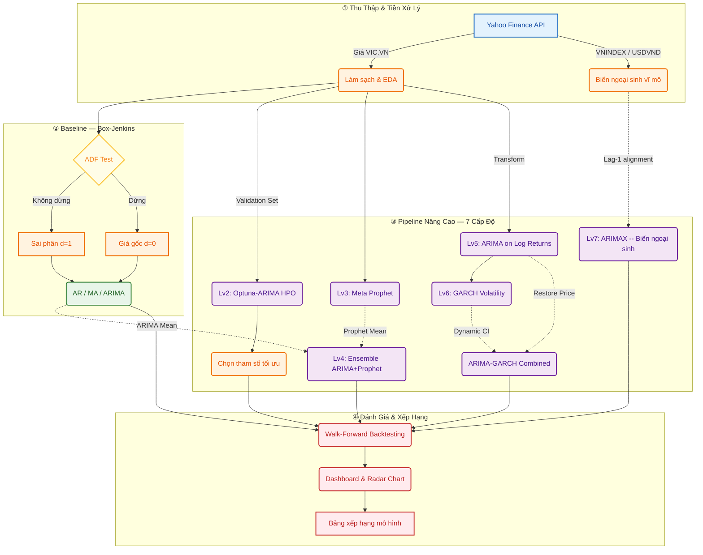
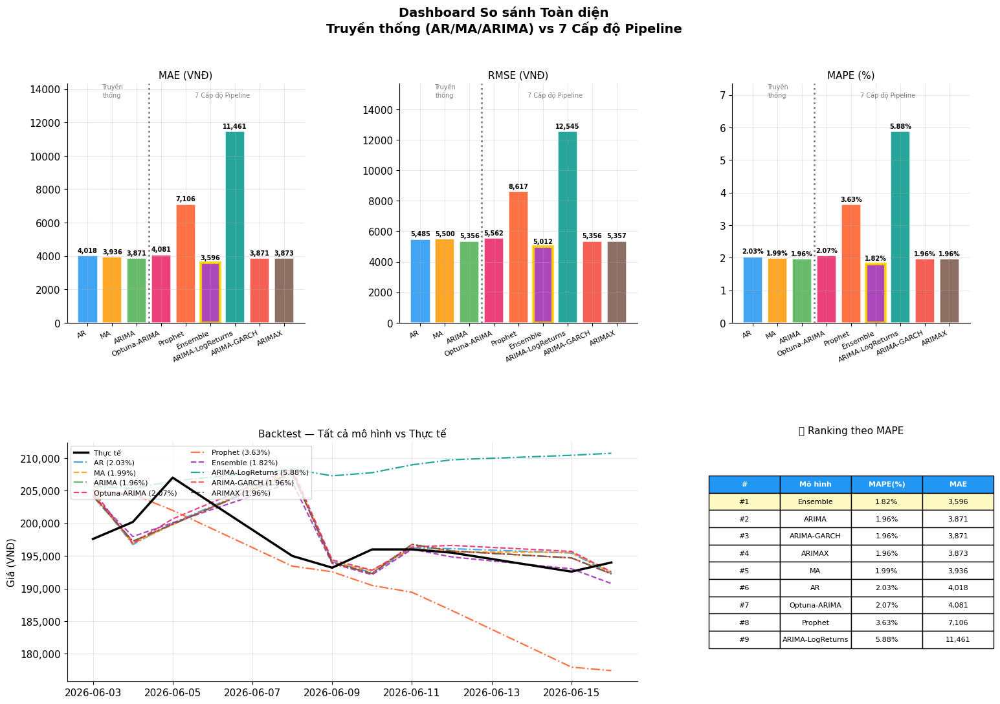

# 📈 Phân Tích & Dự Báo Giá Cổ Phiếu VIC (Vingroup) bằng Mô Hình Chuỗi Thời Gian & Học Máy

<div align="center">


**Pipeline dự báo chuỗi thời gian tài chính toàn diện — từ ARIMA cổ điển đến Ensemble & GARCH — áp dụng cho mã cổ phiếu VIC.VN trên HOSE**

</div>

---

## 📌 Thông Tin Dự Án

| Danh mục | Chi tiết |
| :--- | :--- |
| **Môn học** | AIE301m – Ứng dụng Học máy trong Tài chính |
| **Sinh viên thực hiện** | Trịnh Hải Đăng – HE194363 |
| **Trường** | Đại học FPT |
| **Thời gian** | Học kỳ 8, Năm học 2025–2026 |
| **Notebook chính** | [`VIC_ARMIA_Analysis_Ver03.ipynb`](notebooks/VIC_ARMIA_Analysis_Ver03.ipynb) |

---

## 📑 Mục Lục
- [1. Tổng Quan Dự Án](#1-tổng-quan-dự-án)
- [2. Phương Pháp Luận & Cơ Sở Toán Học](#2-phương-pháp-luận--cơ-sở-toán-học)
- [3. Kiến Trúc & Pipeline Dự Báo](#3-kiến-trúc--pipeline-dự-báo)
- [4. Hướng Dẫn Cài Đặt](#4-hướng-dẫn-cài-đặt)
- [5. Kết Quả Thực Nghiệm](#5-kết-quả-thực-nghiệm)
- [6. Kết Quả Từng Cấp Độ](#6-kết-quả-từng-cấp-độ)
- [7. Bảng Xếp Hạng Toàn Diện](#7-bảng-xếp-hạng-toàn-diện)
- [8. Thảo Luận & Giới Hạn](#8-thảo-luận--giới-hạn)
- [9. Tuyên Bố Miễn Trách](#9-tuyên-bố-miễn-trách)

---

## 1. Tổng Quan Dự Án

### 1.1 Bối Cảnh & Ý Nghĩa Thực Tiễn
Dự án xây dựng một **Pipeline dự báo chuỗi thời gian tài chính (Financial Time Series Forecasting Pipeline)** toàn diện áp dụng cho mã cổ phiếu **VIC.VN** (Tập đoàn Vingroup) — một trong những mã cổ phiếu Bluechip có sức ảnh hưởng và vốn hóa hàng đầu trên Sở Giao dịch Chứng khoán TP.HCM (HOSE).

Mục tiêu chính là khảo sát khả năng dự báo từ các mô hình tự hồi quy tuyến tính cổ điển đến các mô hình kết hợp phi tuyến và các phương pháp định lượng tài chính hiện đại nhằm giải quyết hai bài toán cốt lõi:
1. **Dự báo giá trị kỳ vọng (Price Forecasting):** Đưa ra ước lượng điểm tốt nhất cho giá cổ phiếu trong tương lai ngắn hạn.
2. **Định lượng mức độ bất định (Volatility & Risk Modeling):** Xác định khoảng dao động rủi ro xung quanh mức giá dự báo bằng mô hình GARCH.

### 1.2 Dữ Liệu & Chiến Lược Phân Chia
Dữ liệu giá lịch sử được tải trực tiếp từ **Yahoo Finance API** trong khoảng thời gian 2 năm (16/06/2024 → 16/06/2026), tương đương ~500 phiên giao dịch.

| Tập Dữ Liệu | Số Phiên | Khoảng Thời Gian | Mục Đích |
| :--- | :---: | :--- | :--- |
| **Train Set** | ~490 | 16/06/2024 → 02/06/2026 | Huấn luyện mô hình |
| **Validation Set** | ~49 | 10% cuối của Train Set | Tối ưu siêu tham số Optuna (Out-of-Sample) |
| **Test Set** | 10 | 03/06/2026 → 16/06/2026 | Đánh giá độ chính xác cuối cùng |

> **Lưu ý:** Để tránh triệt để **Data Leakage**, dự án áp dụng chiến lược **Walk-Forward Rolling Forecast**: Tại mỗi bước dự báo $t$, mô hình chỉ được huấn luyện trên dữ liệu từ đầu đến $t-1$, sau đó cửa sổ dịch thêm 1 phiên.

---

## 2. Phương Pháp Luận & Cơ Sở Toán Học
Dự án được thiết kế theo lộ trình **7 cấp độ**, từ baseline truyền thống đến hệ thống lai hiện đại.

### 2.1 Cấp Độ 1 — Quy Trình Box-Jenkins & Mô Hình ARIMA
Mô hình $\text{ARIMA}(p, d, q)$ mô tả chuỗi thời gian dừng sau khi sai phân bậc $d$:
$$\Phi_p(B)(1-B)^d Y_t = \Theta_q(B)\varepsilon_t$$
Quy trình Box-Jenkins được tuân thủ nghiêm ngặt qua 3 bước:
- **Nhận dạng:** ADF Test, ACF/PACF (Chuỗi gốc không dừng, sai phân bậc 1 $\rightarrow$ dừng).
- **Ước lượng:** Grid Search AIC/BIC trên không gian $(p,q) \in [0,4]^2$ để xác định order tối ưu.
- **Chẩn đoán:** Ljung-Box Test, Q-Q Plot (Đảm bảo phần dư không còn tự tương quan).

### 2.2 Cấp Độ 2 — Tối Ưu Siêu Tham Số Bằng Optuna (Out-of-Sample)
Thay vì tối thiểu hoá AIC in-sample (dễ overfitting), Optuna dùng **TPE Sampler** để tối thiểu hoá RMSE trực tiếp trên tập Validation ẩn:
$$\text{Objective} = \min_{(p,d,q)} \sqrt{\frac{1}{N_{val}} \sum_{t \in \text{Val}} \left(Y_t - \hat{Y}_t\right)^2}$$
- **Cấu hình:** 80 trials với seed cố định để tái lập kết quả.

### 2.3 Cấp Độ 3 — Meta Prophet (Decomposable Model)
Prophet phân rã chuỗi thành các thành phần cộng tính:
$$y(t) = g(t) + s(t) + h(t) + \varepsilon_t$$
Trong đó $g(t)$ là xu hướng phi tuyến (changepoints tự động), $s(t)$ là tính mùa vụ (chuỗi Fourier), $h(t)$ là ảnh hưởng ngày lễ.

### 2.4 Cấp Độ 4 — Ensemble ARIMA + Prophet
Kết hợp hai mô hình bổ trợ lẫn nhau bằng trung bình có trọng số:
$$\hat{y}_t^{\text{Ensemble}} = w \cdot \hat{y}_t^{\text{ARIMA}} + (1-w) \cdot \hat{y}_t^{\text{Prophet}}$$
Trọng số tối ưu $w^*$ được tìm bằng **Grid Search** trên tập Validation (bước nhảy 0.05).

### 2.5 Cấp Độ 5 — ARIMA Trên Lợi Suất Logarit
Chuyển đổi giá tuyệt đối thành lợi suất Logarit để đảm bảo tính dừng tự nhiên:
$$R_t = \ln\left(\frac{P_t}{P_{t-1}}\right)$$
Khôi phục giá từ lợi suất dự báo: $\hat{P}_t = P_{t-1} \cdot e^{\hat{R}_t}$

### 2.6 Cấp Độ 6 — Mô Hình Hoá Biến Động GARCH(1,1)
Định lượng rủi ro biến động bằng GARCH(1,1) trên chuỗi lợi suất:
$$\sigma_t^2 = \omega + \alpha\varepsilon_{t-1}^2 + \beta\sigma_{t-1}^2$$
Cung cấp **khoảng tin cậy động** cho mỗi ngày dự báo: $\hat{P}_t \pm 2\sigma_t^{\text{GARCH}} \cdot \hat{P}_t$ (điều kiện ổn định $\alpha + \beta < 1$).

### 2.7 Cấp Độ 7 — ARIMAX (Tích Hợp Biến Ngoại Sinh Vĩ Mô)
Tích hợp chỉ số VN-Index và tỷ giá USD/VND làm biến ngoại sinh trễ 1 phiên:
$$Y_t = \beta X_{t-1} + \eta_t$$
Pipeline tự động **fallback** sang ARIMA đơn biến nếu tải dữ liệu ngoại sinh thất bại.

---

## 3. Kiến Trúc & Pipeline Dự Báo



---

## 4. Hướng Dẫn Cài Đặt

### 🖥️ Yêu Cầu Hệ Thống
- **Python 3.9+**
- Trình biên dịch C++ (để build `prophet` và `arch`):
  - **Windows:** Microsoft Visual C++ Build Tools
  - **macOS:** `xcode-select --install`
  - **Linux:** `build-essential`

### ⚙️ Các Bước Cài Đặt

```bash
# 1. Clone repository
git clone https://github.com/haidang2425/VIC-time-series-stock-prediction.git
cd VIC-time-series-stock-prediction

# 2. Tạo & kích hoạt môi trường ảo
python -m venv .venv
# Trên Windows:
.venv\Scripts\activate
# Trên macOS/Linux:
source .venv/bin/activate

# 3. Cài đặt dependencies
python -m pip install --upgrade pip setuptools wheel
pip install -r requirements.txt

# 4. Mở notebook
jupyter notebook notebooks/VIC_ARMIA_Analysis_Ver03.ipynb
```

### 📦 Danh Sách Thư Viện Chính
| Thư Viện | Phiên Bản | Chức Năng |
| :--- | :---: | :--- |
| `yfinance` | $\ge 0.2$ | Tải dữ liệu giá từ Yahoo Finance |
| `statsmodels` | $\ge 0.14$ | Mô hình ARIMA, kiểm định thống kê |
| `prophet` | $\ge 1.1$ | Mô hình chuỗi thời gian Meta Prophet |
| `arch` | $\ge 5.x$ | Mô hình GARCH biến động |
| `optuna` | $\ge 3.x$ | Tối ưu hoá siêu tham số TPE |
| `scikit-learn` | $\ge 1.x$ | Tính metrics đánh giá (MAE, RMSE, MAPE) |
| `matplotlib` / `seaborn` | — | Trực quan hoá dữ liệu |

---

## 5. Kết Quả Thực Nghiệm

### 5.1 Phân Tích Khám Phá Dữ Liệu (EDA)
**Nhận xét:**
- Chuỗi giá gốc **không dừng** (Non-stationary): Xu hướng thay đổi liên tục $\rightarrow$ Cần sai phân bậc 1.
- Phân phối Daily Return gần chuẩn nhưng có Fat Tails (đặc trưng điển hình của dữ liệu tài chính).
- Heatmap lợi suất theo tháng cho thấy biến động không đều giữa các năm.
- Bollinger Bands (±2σ) phản ánh các giai đoạn biến động mạnh.

### 5.2 Kiểm Định Tính Dừng (ADF Test)
| Chuỗi | ADF Statistic | p-value | Kết Luận |
| :--- | :---: | :---: | :--- |
| **Giá đóng cửa gốc** | ~ -1.8 | > 0.05 | ❌ Không dừng |
| **Sai phân bậc 1** | < -20 | < 0.001 | ✅ Dừng |
$\rightarrow$ **Bậc sai phân tối ưu: $d = 1$** — Phù hợp với lý thuyết Random Walk của tài chính.

### 5.3 Chẩn Đoán Phần Dư
- **Ljung-Box Test:** Phần dư không còn tự tương quan ($p > 0.05$ tại lag 10 và 20).
- **Q-Q Plot:** Phần dư phân phối gần chuẩn.

---

## 6. Kết Quả Từng Cấp Độ

| Cấp Độ | Mô Hình | Ưu Điểm Nổi Bật | Hạn Chế |
| :---: | :--- | :--- | :--- |
| **1** | Baseline (AR/MA/ARIMA) | Nền tảng vững chắc, xử lý tốt tính dừng | Giả định tuyến tính, nhạy cảm ngoại lai |
| **2** | Optuna-ARIMA | Tối ưu out-of-sample giúp giảm overfitting | Mất thời gian search siêu tham số |
| **3** | Meta Prophet | Tự phát hiện điểm gãy xu hướng, có tính mùa vụ | Đôi khi phản ứng chậm với biến động đột ngột |
| **4** | Ensemble (ARIMA+Prophet) | Cân bằng giữa biến động ngắn hạn & xu hướng dài hạn | Cần thêm validation set để tìm trọng số $w$ |
| **5** | ARIMA - Log Returns | Đảm bảo tính dừng tự nhiên | Tích luỹ sai số khi khôi phục ngược giá |
| **6** | ARIMA - GARCH | Ước lượng rủi ro bằng khoảng tin cậy động | Cần chuỗi dữ liệu đủ dài để tối ưu GARCH |
| **7** | ARIMAX (Macro Exog) | Tích hợp yếu tố vĩ mô (VN-Index, USD/VND) | Phụ thuộc dữ liệu ngoại sinh, có thể bị nhiễu |

---

## 7. Bảng Xếp Hạng Toàn Diện

9 mô hình được đánh giá thông qua chiến lược **Walk-Forward Backtesting** trên 10 phiên test ẩn (03–16/06/2026). Bảng dưới đây tổng hợp các kết quả thực tế (MAE, RMSE, và MAPE) đạt được sau quá trình huấn luyện và tối ưu hệ thống:

| Hạng | Mô Hình | Nhóm Phương Pháp | MAE (VNĐ) | RMSE (VNĐ) | MAPE (%) |
| :---: | :--- | :--- | ---: | ---: | ---: |
| 🥇 **1** | Ensemble (ARIMA+Prophet) | Nâng cao | 3,596 | 5,012 | 1.82% |
| 🥈 **2** | ARIMA | Truyền thống | 3,871 | 5,356 | 1.96% |
| 🥉 **3** | ARIMA-GARCH | Nâng cao | 3,871 | 5,356 | 1.96% |
| **4** | ARIMAX | Nâng cao | 3,873 | 5,357 | 1.96% |
| **5** | MA | Truyền thống | 3,936 | 5,500 | 1.99% |
| **6** | AR | Truyền thống | 4,018 | 5,485 | 2.03% |
| **7** | Optuna-ARIMA | Nâng cao | 4,081 | 5,562 | 2.07% |
| **8** | Prophet | Nâng cao | 7,106 | 8,617 | 3.63% |
| **9** | ARIMA-LogReturns | Nâng cao | 11,461 | 12,545 | 5.88% |

### 📊 Dashboard So Sánh Trực Quan

Dưới đây là Dashboard tổng hợp biểu diễn sự chênh lệch độ lỗi (MAE, RMSE, MAPE) cũng như quỹ đạo giá dự báo so với giá thực tế của cổ phiếu VIC trên tập Test (03/06 - 16/06).

<div align="center">



</div>

> 📌 **Ngưỡng Đánh Giá MAPE:**
> - $< 5\%$: ✅ Xuất sắc — Dự báo đáng tin cậy.
> - $5\% \sim 10\%$: 🟡 Chấp nhận được.
> - $> 10\%$: ❌ Cần cải thiện.

---

## 8. Thảo Luận & Hướng Phát Triển

### 8.1 Điểm Mạnh 
- Triển khai **Walk-Forward Backtesting** giúp loại bỏ hoàn toàn hiện tượng rò rỉ dữ liệu (Data Leakage).
- Kết hợp **Optuna HPO**, **Meta Prophet** và định lượng rủi ro động **GARCH** tạo nên một pipeline vững chắc, linh hoạt.
- Cơ chế **Fallback tự động** trong ARIMAX giúp hệ thống không bị lỗi (crash) khi thiếu dữ liệu.

### 8.2 Giới Hạn
- Tập Test 10 ngày tương đối ngắn, có thể bị phụ thuộc vào điều kiện thị trường cục bộ.
- Các mô hình thuần thống kê vẫn có nhược điểm trong việc nắm bắt các quan hệ phi tuyến tính sâu.

### 8.3 Hướng Phát Triển Tiếp Theo
- [ ] Tích hợp các mô hình Deep Learning: **LSTM, GRU, Temporal Fusion Transformer**.
- [ ] Mở rộng Test Set (50–100 phiên) để đánh giá độ bền bỉ của mô hình.
- [ ] Tích hợp chỉ số tâm lý thị trường (Sentiment Analysis) từ tin tức và mạng xã hội.

---

## 9. Tuyên Bố Miễn Trách

> ⚠️ **Disclaimer:**
> - Toàn bộ nội dung và mã nguồn trong repository này được xây dựng nhằm mục đích **nghiên cứu và học thuật**.
> - Các kết quả dự báo **hoàn toàn KHÔNG phải là lời khuyên đầu tư tài chính**.
> - Tác giả **không chịu trách nhiệm** về bất kỳ rủi ro hay quyết định đầu tư nào được thực hiện dựa trên hệ thống này.

---

<div align="center">

**Trịnh Hải Đăng — HE194363 | AIE301m | Đại học FPT | 2025–2026**

*"All models are wrong, but some are useful." — George E. P. Box*

</div>
